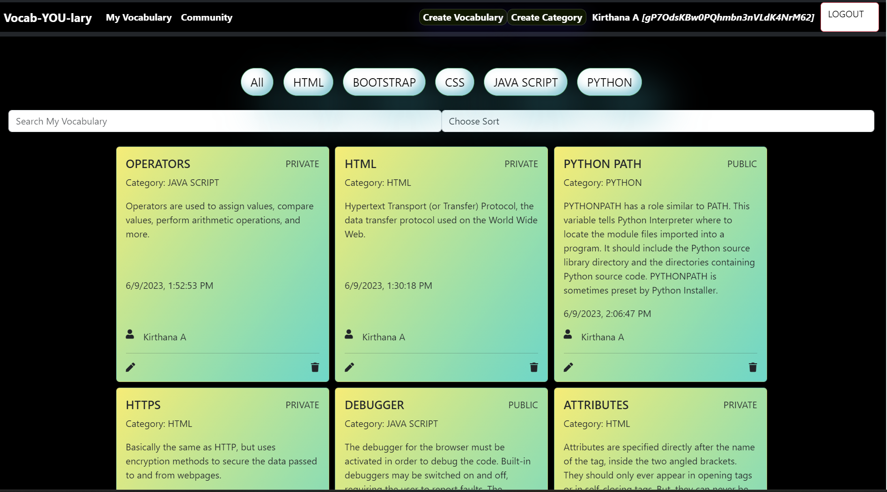

## vocab-YOU-lary

## Overview of the project
Vocab-YOU-lary is a website which allows the user to create vocabularies and make them private and public. It also provides create, update, delete vocabulary options. User can also create categories too. 

## Link/screenshot of data flowchart
<https://www.figma.com/file/z4ujysJb1TvbgsnMmORNbr/vocab-YOU-lary?type=whiteboard&node-id=502%3A3070&t=gGSc7AcZZKMwqNxk-1>

## Link to the deployed project
<https://kirthuvocabulary.netlify.app/>

## Link to the project board
<https://github.com/Kirthuarun/INDIVIDUAL-ASSESSMENT-vocab-YOU-lary>

## Description of the users
Any user can understand the function of the website and access them with their Google authentications. 

## List of features
* User can login with their unique Google-auth and create, delete, update vocabularies.
* User can create their own categories too.
* User can make their entries private and public. They could choose both.

## ScreenShot of the project

## List of contributors and links to their GitHub profiles
<https://github.com/Kirthuarun/INDIVIDUAL-ASSESSMENT-vocab-YOU-lary>

## Link to Loom video walkthrough of the app
<https://www.loom.com/share/98443c79c81a4201a8a3650bb154dd97>